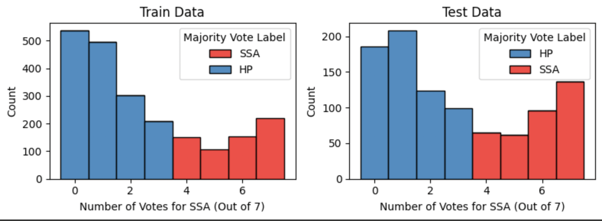

# Histopathology-Classification

We have used Resnet-18 pretrained model and Vision Transformer to perform the classification. We observe slightly better performance with Vision Transformers.

### Dataset Statistics

This dataset comprises 3,152 hematoxylin and eosin (H&E)-stained Formalin Fixed Paraffin-Embedded (FFPE) fixed-size images (224 by 224 pixels) of colorectal polyps from the Department of Pathology and Laboratory Medicine at Dartmouth-Hitchcock Medical Center (DHMC). The dataset is de-identified and released with permission from Dartmouth-Hitchcock Health (D-HH) Institutional Review Board (IRB). 

The images fall into either of these classes:

- Hyperplastic Polyp (HP)
- Sessile Serrated Adenoma (SSA)

