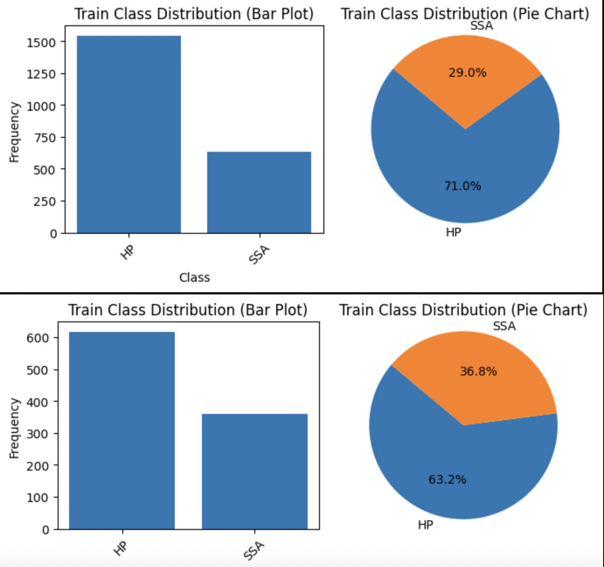

# Histopathology-Classification

### Abstarct
The Jupyter notebook contains all the Exploratory Data Analysis, preprocessing results, training results and evaluation. The code can be understood by looking at this .ipynb file as starting point. All helper functions are written in eda.py (preprocessing), train.py (training) and eval.py (evaluation and visualisation)

We have used Resnet-18 pretrained model and Vision Transformer to perform the classification. We observe slightly better performance with Vision Transformers.

### Dataset Statistics

This dataset comprises 3,152 hematoxylin and eosin (H&E)-stained Formalin Fixed Paraffin-Embedded (FFPE) fixed-size images (224 by 224 pixels) of colorectal polyps from the Department of Pathology and Laboratory Medicine at Dartmouth-Hitchcock Medical Center (DHMC). The dataset is de-identified and released with permission from Dartmouth-Hitchcock Health (D-HH) Institutional Review Board (IRB). 

The images fall into either of these classes:

- Hyperplastic Polyp (HP)
- Sessile Serrated Adenoma (SSA)

We notice a class imbalance and to fix this we perform upsampling, by incorporating augmentation via random rotation and mirroring. SMOTE upsampling was experimented with but it started to give poor results. So we resort to our custom sampling.

We have used CLAHE to visualize the features better:

While CLAHE enhances image features it may or may not lead to an improved performance in our model as deep convolutional neural networks are good at simulating such preprocessing. We should however test this on a case by case basis.

### Models Used
As an experiment, we tried a custom 6-layer CNN as our primitive model for the classification. This led to an accuracy of 70% and AUC of 0.68
Secondly we tried Resnet-18 which led to an accuracy of and AUC of 
Third, we tried a pretrained Vision Transformer (Trained on Imagenet-21k) which led to an accuracy of and AUC of

Overall Vision Transformer gave the best results and the F1 score improved as well

### Visualising Results
We have used grad-cam module to visualise the results and provide heatmaps of regions in the image the predominantly gave rise to classification towards the predicted label.

